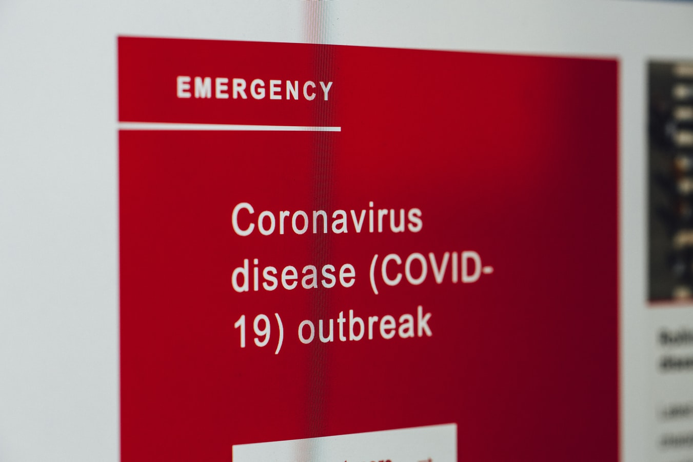

<!DOCTYPE html>
<html class="no-js">

<head>
    <meta charset="utf-8">
    <title>COVID-19 Info</title>
    <!-- Use mobile-aware viewport -->
    <meta name="viewport" content="width=device-width, initial-scale=1, shrink-to-fit=no">
    <link rel="stylesheet" href="main.css">
    

  

<!--testing google translator here-->

    
    

    
</head>

<body>
    <header>
        

            

                

                    <h1>COVID-19 Info</h1>
                

            

            

                <nav>
                    <ul>
                        <li><a href="news.html">home</a></li>
                        <li><a href="news.html">news</a></li>
                        <li><a href="hospital.html">hospitals</a></li>
                        <li><a href="data.html">data</a></li>
                        <li><a href="location.html">essential locations</a></li>
                    </ul>
                </nav>
            

            

            

            

                

                    
Profile

                    
Sign Out

                

            

        

    </header>
    <section class="newsbanner">
        

            <h2>GET THE WORLD'S LATEST COVID-19 NEWS</h2>

            

                <h3>Coronavirus in Illinois updates: Chicago officials change city’s vaccine deployment strategy; Loretto Hospital to resume distributing vaccines; state reports 3,866 new cases and 21 more deaths by Chicago Tribune</h3>
            

        

        

            

                
                

                    <h2>Coronavirus in Illinois: 3,866 New COVID Cases, 21 Deaths, 166K Vaccinations</h2>
                    
Illinois health officials reported 3,866 new confirmed and probable coronavirus cases and 21 additional deaths in the last day, along with nearly 167,000 vaccinations administered.

                    <a href="https://www.nbcchicago.com/news/coronavirus/coronavirus-in-illinois-3866-new-covid-cases-21-deaths-166k-vaccinations/2488354/">Read More</a>
                

            

            

                
                

                    <h2>COVID-19 Vaccination Locations on VaccineFinder</h2>
                    
VaccineFinder helps people find the latest information on COVID-19 vaccine.

                    <a href="https://www.cdc.gov/vaccines/covid-19/reporting/vaccinefinder/about.html">Read More</a>
                

            

    </section>

    </section>

</body>

</html>
